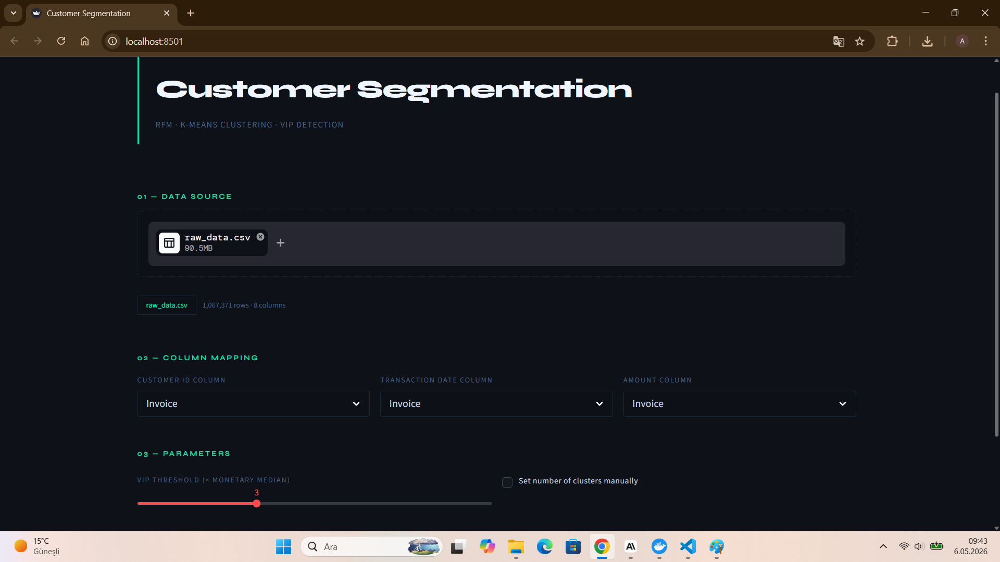
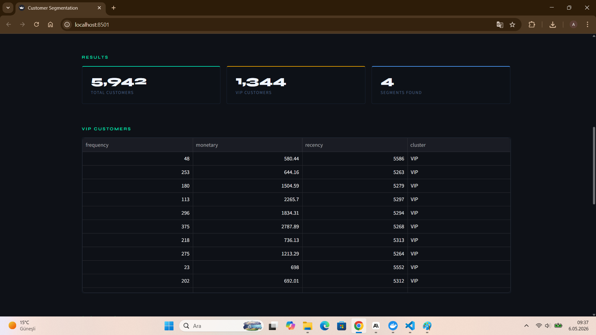
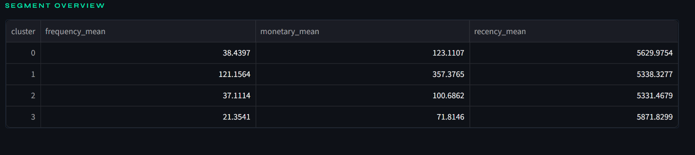
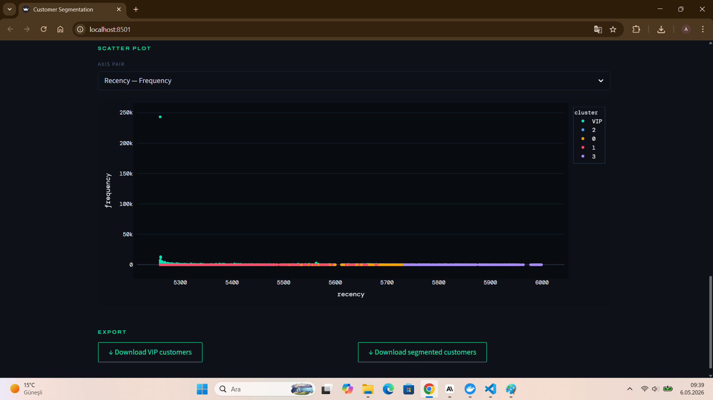

# Customer Segmentation



## Project Content
This is an end-to-end data-analysis project that provides the user to divide his clients into segments and make offers to them according to mean of each frequency, recency and monetary features in order to prevent making the same offer to every client. Therefore, the business expenses are reduced by making special offer to every client segment.

## How does it work?
- Firstly the user upload clients' data as CSV or XLSX
- New RFM (Recency, Frequency, Monetary) columns are created while data preprocessing
- The data is divided into two. VIP clients, whose total monetary value exceeds 3 times the monetary median and normal clients
- The best number of cluster are determined based on RFM columns using the elbow method
- Finally, the segments and VIP clients are shown in the Streamlit UI

## Screenshots

### Results


### Segments


### Scatter Plot


## Tech Stack

- **Language:** Python 3.12
- **Api Framework:** FastAPI
- **Deployment:** Docker & Docker Compose

## Getting Started
To run this project locally, ensure you have Docker installed

1. Clone the repository:
   ```bash
   git clone https://github.com/afdemir06/customer-segmentation.git
   cd customer-segmentation
   ```

2. Start the service using Docker Compose:
    ```bash
    docker-compose up --build
    ```